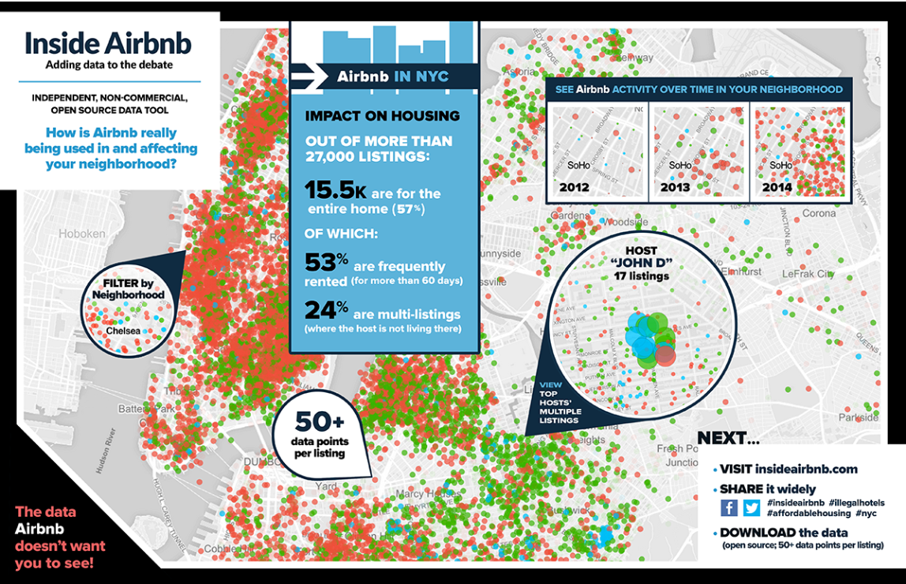
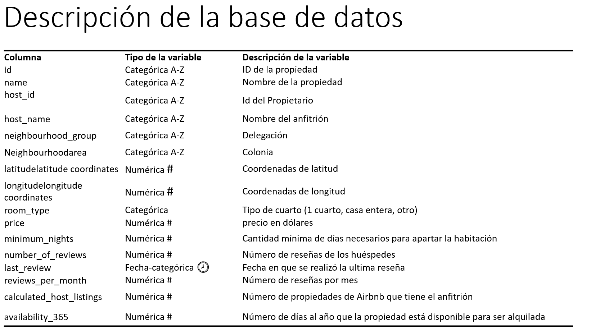

Equipo:

* Javier Valencia Goujon C.U. 123227
* Alfie Sergio González Salcedo C.U. 181574

```{r warning = FALSE, echo = FALSE, results = 'hide'}
directorio <- '/Users/alfie-gonzalez/Documents/Maestría/Primer Semestre/Aprendizaje de Máquina/'
knitr::opts_chunk$set(root.dir=normalizePath(directorio), echo = TRUE)
setwd(directorio)
```

## Introducción  

Encontramos en Kaggle una base de datos de Airbnb en Nueva York que tiene 5 meses de que fue publicada. Nos resultó interesante aplicar las técincas de aprendizaje de maquina y generar un modelo para predecir el precio de renta de los cuartos de Airbnb.

Adicionalmente, exploramos la técnica de feature hashing para manejar variables categóricas que tenían muchas clases.



### Descripción de la base de datos

La base de datos originalmente contaba con 48,885 observaciones y 16 variables. Después del proceso de limpieza de los datos nos quedamos con 38,811 observaciones y 11 variables.  

  

### Feature Hashing  

*¿Qué es?*   
Es una técnica de reducción de dimensionalidad donde se usa una función hash para mapear los valores de los features a índices en un vector de features.    
*¿Cuándo se usa y para qué?*   
Con “high dimensional input data” que es “sparse”.  
*Ventajas:*  
Uso eficiente de memoria, rápido y simple, conserva el sparcity, fácil manejo de datos faltantes, ingeniería de características
*Desventajas:*  
No hay inverse mapping, mala interpretabilidad y características importantes, hash collisions, impacto en la precisión de hash collisions.

## Código

Cargamos los datos:

```{r}
directorio <- '/Users/alfie-gonzalez/Documents/Maestría/Primer Semestre/Aprendizaje de Máquina/'
setwd(directorio)

library(tidyverse)

rmse <- function(y, pred){
  return(sqrt(mean((y-pred)^2)))
}

r2_score <- function(y, pred){
  return(1-sum((y-pred)^2)/sum((y-mean(y))^2))
}

datos <- read_csv('AB_NYC_2019.csv') %>% 
  drop_na() %>% 
  filter(price>0)

```

Originalmente la dimensión de la base era

```{r}
read_csv('AB_NYC_2019.csv') %>% dim
```

Y el número de observaciones con datos faltantes era

```{r}
nrow(read_csv('AB_NYC_2019.csv')) - (nrow(datos))
```

La base original tenía las siguientes variables:

```{r}
colnames(read_csv('AB_NYC_2019.csv'))
```

Decidimos quedarnos con las siguientes variables:

```{r}
colnames(datos)
```

Dividimos los datos en 50% entrenamiento, 25% validación y 25% prueba:

```{r}
n <- nrow(datos)
set.seed(123)
indices_ent <- sample(1:n, floor(n*0.50), replace = FALSE)
set.seed(123)
u <- runif(n-length(indices_ent))
indices_val <- ((1:n)[-indices_ent])[u<=0.5]
indices_pr <- ((1:n)[-indices_ent])[u>0.5]
```


Creamos la matriz de estudio:

```{r}
X <- datos %>% select(neighbourhood_group, 
                      neighbourhood, 
                      latitude, 
                      longitude, 
                      room_type, 
                      minimum_nights, 
                      number_of_reviews, 
                      reviews_per_month, 
                      calculated_host_listings_count, 
                      availability_365) %>% 
  mutate(neighbourhood_group = factor(neighbourhood_group), 
         neighbourhood = factor(neighbourhood), 
         room_type = factor(room_type))
```

Lo que vamos a modelar es $y_i = \log(\text{precio}_i+1)$:

```{r}
y <- log(datos$price+1)
```

Creamos la matriz de estudio, la matriz para entrenamiento, validación y prueba:

```{r}
library(Matrix)

x_mat <- model.matrix(y ~ ., data = X) %>% as.data.frame()

x_ent <- x_mat[indices_ent,]
y_ent <- y[indices_ent]
x_val <- x_mat[indices_val,]
y_val <- y[indices_val]
x_pr <- x_mat[indices_pr,]
y_pr <- y[indices_pr]
```


## Regresión Lineal

Definimos un modelo de regresión lineal:

```{r}
modelo_reg <- lm(y_ent ~., data = x_ent)

pred <- predict(modelo_reg, x_val)
pred_reg_val <- pred
pred_reg_ent <- predict(modelo_reg, x_ent)
pred_reg_pr <- predict(modelo_reg, x_pr)
```

## Ridge

Definimos un modelo de regresión Ridge. Elegimos el valor de $\lambda$ con validación cruzada:

```{r}
library(glmnet)

cv_mod <- cv.glmnet(as.matrix(x_ent), y_ent, 
                    alpha = 0,
                    lambda = exp(seq(-12, 2, 0.5)))

lambda.min <- cv_mod$lambda.min
```

Definimos el modelo:

```{r}
modelo_ridge <- glmnet(as.matrix(x_ent), y_ent, 
                       alpha = 0, 
                       lambda = lambda.min)

pred <- predict(modelo_ridge, as.matrix(x_val))
pred_ridge_val <- pred
pred_ridge_ent <- predict(modelo_ridge, as.matrix(x_ent))
pred_ridge_pr <- predict(modelo_ridge, as.matrix(x_pr))
```


## Bosque Aleatorio

Definimos un modelo de bosque aleatorio:

```{r}
library(ranger)

x_ent <- X[indices_ent,]
y_ent <- y[indices_ent]
x_val <- X[indices_val,]
y_val <- y[indices_val]
x_pr <- X[indices_pr,]
y_pr <- y[indices_pr]

modelo_bosque <- ranger(y_ent ~ ., data = x_ent, 
                        num.trees = 400, mtry = 2, 
                        importance = "permutation", 
                        num.threads = 3)

pred <- predict(modelo_bosque, x_val)$predictions
pred_bosque_val <- pred
pred_bosque_ent <- predict(modelo_bosque, x_ent)$predictions
pred_bosque_pr <- predict(modelo_bosque, x_pr)$predictions
```

## XGBoost

Definimos un modelo de XGBoost. Determinamos con validación cruzada el número de iteraciones adecuado:

```{r}
library(xgboost)

x_mat <- model.matrix(y ~ ., data = X) %>% as.matrix()

x_ent <- x_mat[indices_ent,]
y_ent <- y[indices_ent]
x_val <- x_mat[indices_val,]
y_val <- y[indices_val]
x_pr <- x_mat[indices_pr,]
y_pr <- y[indices_pr]

d_ent <- xgb.DMatrix(data = x_ent, label = y_ent)
d_val <- xgb.DMatrix(data = x_val, label = y_val)
d_pr <- xgb.DMatrix(data = x_pr, label = y_pr)

params = list(
  objective = "reg:linear",
  eta = 0.05, # tamaño de paso
  max_depth = 4, # profundidad de árboles
  lambda = 0)

set.seed(812) # para validación cruzada

ajustar_mod <- function(d_ent, verbose = 0, nrounds = 400, 
                        params){
  #dput(params)
  mod_boost_cv <- xgb.cv(params = params, 
                         data = d_ent,
                         nfold = 10, 
                         nrounds = nrounds, # número de árboles
                         predictions = TRUE, 
                         print_every_n = 40, 
                         nthread = 3, # modificar según recursos
                         verbose = verbose)
  eval_tbl <- mod_boost_cv$evaluation_log %>% 
    gather(variable, valor, -iter) %>% 
    separate(variable, into = c("tipo", "metrica", "res")) %>% 
    spread(res, valor)
  #print(str(tail(eval_tbl, 2)))
  eval_tbl
}

res <- ajustar_mod(d_ent, verbose = 1, params = params)
```

Vemos el número de iteraciones que dio el mejor error de validación:

```{r}
res %>% filter(tipo == "test") %>% 
  arrange(mean) %>% head

transformar_eval <- function(mod_boost_cv){
  eval_tbl <- mod_boost_cv$evaluation_log %>% 
    gather(variable, valor, -iter) %>% 
    separate(variable, into = c("tipo", "metrica", "res")) %>% 
    spread(res, valor)
  eval_tbl
}
```

Graficamos el error de entrenamiento vs el error de validación:

```{r}
graficar_vc <- function(eval_tbl){
  error_entrena <- eval_tbl %>% filter(tipo == "train") %>% pull(mean) %>% last
  error_val <- eval_tbl %>% filter(tipo == "test") %>% pull(mean) %>% last
  sd_error_val <- eval_tbl %>% filter(tipo == "test") %>% pull(std) %>% last
  sprintf("Error entrena: %.2f, Error valida: %.2f, se valida: %.2f", 
          error_entrena, error_val, sd_error_val) %>% print
  ggplot(eval_tbl, aes(x = iter, y = mean, ymin = mean - std, ymax = mean + std,
                       colour = tipo)) +
    scale_y_log10(breaks = c(0.1, 0.2, 0.4, 0.8, 1.6, 3.2)) +
    geom_point() + geom_linerange()
}

res %>% graficar_vc()
```

Elegimos iterar 200 veces. Definimos el modelo:

```{r}
params = list(
  objective = "reg:linear",
  eta = 0.1, # tamaño de paso
  max_depth = 4, # profundidad de árboles
  subsample = 0.5, 
  lambda = 0)

modelo_xgboost <- xgb.train(params = params, 
                       data = d_ent, 
                       nrounds = 200, # número de árboles 
                       predictions = TRUE, 
                       print_every_n = 40, 
                       nthread = 3, # modificar según recursos 
                       verbose = 1)

pred <- predict(modelo_xgboost, d_val)
pred_xgboost_val <- pred
pred_xgboost_ent <- predict(modelo_xgboost, d_ent)
pred_xgboost_pr <- predict(modelo_xgboost, d_pr)
```

## Incorporar variable host_id

## Feature hashing

Vamos a agregar la variable host_id al modelo:

Definimos la matriz de estudio:

```{r}
X <- datos %>% select(host_id, neighbourhood_group, neighbourhood, 
                      latitude, longitude, room_type, minimum_nights, 
                      number_of_reviews, reviews_per_month, 
                      calculated_host_listings_count, 
                      availability_365) %>% 
  mutate(host_id = factor(host_id), 
         neighbourhood_group = factor(neighbourhood_group), 
         neighbourhood = factor(neighbourhood), 
         room_type = factor(room_type))

y <- log(datos$price+1)

x_ent <- X[indices_ent,]
y_ent <- y[indices_ent]
x_val <- X[indices_val,]
y_val <- y[indices_val]
x_pr <- X[indices_pr,]
y_pr <- y[indices_pr]
```

Observamos que la variable host_id tiene `r datos$host_id %>% unique() %>% length()` clases. Esto generaría una matriz muy grande para el modelo si usamos la función `model.matrix()`. Usamos la técnica de feature hashing para reducir la dimensión de la matriz del modelo. Definimos las matrices de entrenamiento, validación y prueba:

```{r}
library(FeatureHashing)

h_ent <- hashed.model.matrix(~., data = x_ent, hash.size = 2^9) %>% 
  as.matrix() %>% as.data.frame()
h_val <- hashed.model.matrix(~., data = x_val, hash.size = 2^9) %>% 
  as.matrix() %>% as.data.frame()
h_pr <- hashed.model.matrix(~., data = x_pr, hash.size = 2^9) %>% 
  as.matrix() %>% as.data.frame()
```

Las dimensiones de las matrices de entrenamiento, validación y prueba son respectivamente.

```{r}
dim(h_ent)
dim(h_val)
dim(h_pr)
```

## Regresión

Definimos un modelo de regresión lineal:

```{r}
library(Matrix)

x_ent <- X[indices_ent,]
y_ent <- y[indices_ent]
x_val <- X[indices_val,]
y_val <- y[indices_val]
x_pr <- X[indices_pr,]
y_pr <- y[indices_pr]


modelo_reg <- lm(y_ent ~., data = h_ent)

pred <- predict(modelo_reg, h_val)
pred_regh_val <- pred
pred_regh_ent <- predict(modelo_reg, h_ent)
pred_regh_pr <- predict(modelo_reg, h_pr)
```

## Ridge

Definimos un modelo de regresión Ridge. Elegimos el valor de $\lambda$ con validación cruzada:

```{r}
library(glmnet)

cv_mod <- cv.glmnet(as.matrix(h_ent), y_ent, 
                    alpha = 0,
                    lambda = exp(seq(-12, 2, 0.5)))

lambda.min <- cv_mod$lambda.min
```

Definimos el modelo:

```{r}
modelo_ridge <- glmnet(as.matrix(h_ent), y_ent, 
                       alpha = 0, 
                       lambda = lambda.min)

pred <- predict(modelo_ridge, as.matrix(h_val))
pred_ridgeh_val <- pred
pred_ridgeh_ent <- predict(modelo_ridge, as.matrix(h_ent))
pred_ridgeh_pr <- predict(modelo_ridge, as.matrix(h_pr))
```


## Bosque Aleatorio

Definimos un modelo de bosque aleatorio. Aquí ya no usamos feature hashing:

```{r}
library(ranger)

x_ent <- X[indices_ent,]
y_ent <- y[indices_ent]
x_val <- X[indices_val,]
y_val <- y[indices_val]
x_pr <- X[indices_pr,]
y_pr <- y[indices_pr]

modelo_bosque <- ranger(y_ent ~ ., data = x_ent, 
                        num.trees = 400, mtry = 2, 
                        importance = "permutation", 
                        num.threads = 3)

pred <- predict(modelo_bosque, x_val)$predictions
pred_bosqueh_val <- pred
pred_bosqueh_ent <- predict(modelo_bosque, x_ent)$predictions
pred_bosqueh_pr <- predict(modelo_bosque, x_pr)$predictions
```


## Resumen

Reportamos los modelos utilizados con su valor de rmse y $R^2$ para los conjuntos de entrenamiento, validación y prueba:

```{r}
resumen <- data.frame(Modelo = c(rep('Regresión', 3), rep('Ridge', 3), 
                                 rep('Bosque Aleatorio', 3), 
                                 rep('XGBoost', 3), rep('Regresión', 3), 
                                 rep('Ridge', 3), rep('Bosque Aleatorio', 3)), 
                      Conjunto = c(rep(c('Entrenamiento', 'Validación', 
                                         'Prueba'), 7)), 
                      rmse = c(rmse(y_ent, pred_reg_ent), 
                               rmse(y_val, pred_reg_val), 
                               rmse(y_pr, pred_reg_pr), 
                               rmse(y_ent, pred_ridge_ent), 
                               rmse(y_val, pred_ridge_val), 
                               rmse(y_pr, pred_ridge_pr),
                               rmse(y_ent, pred_bosque_ent), 
                               rmse(y_val, pred_bosque_val), 
                               rmse(y_pr, pred_bosque_pr),
                               rmse(y_ent, pred_xgboost_ent), 
                               rmse(y_val, pred_xgboost_val), 
                               rmse(y_pr, pred_xgboost_pr),
                               rmse(y_ent, pred_regh_ent), 
                               rmse(y_val, pred_regh_val), 
                               rmse(y_pr, pred_regh_pr),
                               rmse(y_ent, pred_ridgeh_ent), 
                               rmse(y_val, pred_ridgeh_val), 
                               rmse(y_pr, pred_ridgeh_pr),
                               rmse(y_ent, pred_bosqueh_ent), 
                               rmse(y_val, pred_bosqueh_val), 
                               rmse(y_pr, pred_bosqueh_pr)), 
                      r2_score = c(r2_score(y_ent, pred_reg_ent), 
                                   r2_score(y_val, pred_reg_val), 
                                   r2_score(y_pr, pred_reg_pr), 
                                   r2_score(y_ent, pred_ridge_ent), 
                                   r2_score(y_val, pred_ridge_val), 
                                   r2_score(y_pr, pred_ridge_pr),
                                   r2_score(y_ent, pred_bosque_ent), 
                                   r2_score(y_val, pred_bosque_val), 
                                   r2_score(y_pr, pred_bosque_pr),
                                   r2_score(y_ent, pred_xgboost_ent), 
                                   r2_score(y_val, pred_xgboost_val), 
                                   r2_score(y_pr, pred_xgboost_pr),
                                   r2_score(y_ent, pred_regh_ent), 
                                   r2_score(y_val, pred_regh_val), 
                                   r2_score(y_pr, pred_regh_pr),
                                   r2_score(y_ent, pred_ridgeh_ent), 
                                   r2_score(y_val, pred_ridgeh_val), 
                                   r2_score(y_pr, pred_ridgeh_pr),
                                   r2_score(y_ent, pred_bosqueh_ent), 
                                   r2_score(y_val, pred_bosqueh_val), 
                                   r2_score(y_pr, pred_bosqueh_pr)))

resumen
```

## Conclusión

En general el modelo que obtuvo los mejores resultados fue el bosque aleatorio. Notamos que se sobreentrenó considerablemente, pero aun así obtuvo el mejor resultado para el conjunto de prueba, tanto en el caso en el que no se incluyó la variable host_id como en el caso en el que sí se incluyó.

En general todos los modelos tuvieron resultados no muy espectaculares, pues el valor de rmse era considerablemente alto y la $R^2$ no pasaba del valor de 0.65. Al agregar la variable host_id, el error disminuyó un poco y la $R^2$ aumentó ligeramente, aunque no mucho. Consideramos que la variable aumenta mucho la dimensionalidad del modelo en comparación con la mejora que aporta a los pronósticos.

Observamos que otras personas que analizaron los datos de kaggle tuvieron resultados un tanto similares.

Pensamos que esto pudo deberse a que la base no contaba con muchas variables.